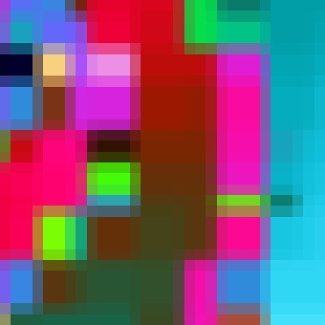
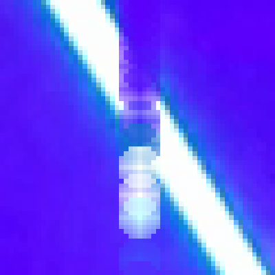
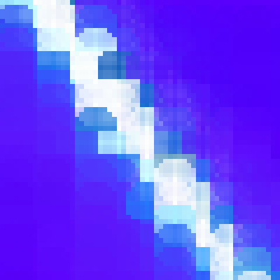

\[click on the image to watch the HD version with lower framerate\]  
[](https://rockingship.github.io/splash-media/ade/ade-border-1920x1080.mp4)  
\[illustrates the incremental change between two frames\]

# `splash`

Perceptual driven video codec

Instead of an ad with tracking...  
Like to [donate ](https://opencollective.com/RockingShip) some appreciation for the use or inspiration this gives you?

### Welcome to the Wonderful World of rendering on demand

*when insufficient resources force you to prioritize which pixels to render first*

`splash` uses the [`zoomer`](https://rockingship.github.io/jsFractalZoom/README.html) scan-order as basis for encoding.  
The most important pixels go first which aims at what our brain and eyes do best:  detecting colour and contrast change (movement).  
With a scene change our brain needs to accommodate, at first we will not notice the difference between blur or sharp.  
Areas with high change (high motion) attracts the most attention and is what we look at first.  
Our eyes will target that region, and our macula will register that as sharpest.  
Areas seen outside the macula are monochrome and blurry.  
The `zoomer`/`splash` engine tries to prioritize the pixels our mind and macula desires the most.

A full/complete frame consists of a sequence pixel values in order of reducing significance.  
Rulers determine scan-line scoring and pixel ordering.  
A lossy compression can be achieved by truncating the sequence.  
Point of interest is how much can you truncate while keeping the essence of the imagery.  
Focus is therefore on low-bandwidth.  
The examples mentioned below explore the extremes.

`splash` only reorders the scanning sequence of pixels.  
Colour reduction and pixel compression are not part of this project.

The animated image above displays how a single `splash` frame is constructed.  
The border marks processed scan-lines (rows+columns), the number in the lower-left is progress.

`splash` can be a revolutionary new way of frame rendering and gaming:  
Why render 4K worth of pixels with reduced FPS if it's too much for your brain to handle.  
Better would be to render the pixels that matter at a higher FPS and let the lesser pixels catch up later.  
For AI it could be used to reduce visual stimuli while retaining the essence of movement.

Upgrading the data model to process video frames needs some enhancements:

## Table of contents

  - [Welcome to the Wonderful World of rendering on demand](#welcome-to-the-wonderful-world-of-rendering-on-demand)
  - [Frame buffer](#frame-buffer)
  - [Ruler metrics and scoring](#ruler-metrics-and-scoring)
  - [Interpolation](#interpolation)
    - [Opaque rectangle fill](#opaque-rectangle-fill)
    - [Transparent splash fill](#transparent-splash-fill)
  - [Demonstration](#demonstration)
    - [Demo: Amsterdam Dance Event (contains flashing white lights)](#demo-amsterdam-dance-event-contains-flashing-white-lights)
    - [Demo: GTA speeding (contains reckless driving)](#demo-gta-speeding-contains-reckless-driving)
  - [FFmpeg](#ffmpeg)
  - [Manifest](#manifest)
  - [Source code](#source-code)
  - [Versioning](#versioning)
  - [License](#license)

## Frame buffer

The frame buffer is incrementally updated with pixel values from a data model.  
With `zoomer` the frame buffer is additionally shifted/scaled based on the [directional vector](https://rockingship.github.io/jsFractalZoom/README.html#directional-vector).  
For video, a typical implementation of the vector would be a VR headset.  
Using a fixed camera position makes the vector static and largely unnecessary.  
For fast-panning scenes, a vector could be introduced to pre-process frames.

`splash` utilizes a single frame buffer and updates it with pixel values from the current video frame.

## Ruler metrics and scoring

`zoomer` rulers are based on pixel drift, `splash` rulers are based on colour drift.

The horizontal and vertical rulers are metadata for rows and columns as a whole.  
Quantifying colour drift is the sum of colour differences for every pixel on a scan-line (row+column).  
Colours in real-world imagery usually change gradually.  
The greater the colour difference, the greater the movement, the higher the score to render the scan-line first.

## Pixels-Per-Frame

`splash` re-orders the scanning sequence of pixels in a frame.  
A fully rendered frame (all scan-lines processed) is equivalent to an uncompressed frame.  
Compression is achieved by truncating the scanning sequence (dropping the lesser significant pixels).  
Quality/compression is expressed as the ratio of rendered pixels against the total number of pixels per frame.  
The ratio is normalised, and the notation is "1/N", where N may be a fraction.

Setting PPF is equivalent to telling the codec: "from an input image you may sample only N pixels, choose wisely".
A PPF of "1/600" means that 0.166% of the pixels may be sampled, the remaining 99.934% are interpolated.  
With a 900x500 image (used in the samples below), setting a PPF of "1/100" (1%) would be equivalent to down-scaling it to a 90x50 thumbnail.

## Interpolation

The pixels where scan-lines cross are considered exact.  
The value of "exact" pixels are part of the data stream and uncompressed/verbatim.  
Neighbouring pixels are updated using an interpolation method as explained below.

### Opaque rectangle fill

`zoomer` is speed optimised and will flood-fill the rectangle bounded by neighbouring scan-lines.

Example taken from [gallery/demo-36](https://rockingship.github.io/jsFractalZoom?x=-0.7791809354769728&y=-0.13452268920699467&r=1.308069346746607e-13&a=0&density=1&iter=1276&theme=6&seed=166517427)  
Left image is during frame construction and clearly shows different rectangle sizes.  
Right image is after completion.

 

### Transparent splash fill

`splash` will perform a 2D alpha-channel flood-fill.

The splash epicentre is where the scan-lines cross, the radius is set to 5 based on being the best visual experience.  
Splash transparency is linear, based on distance to the epicenter.  
The effect is gradually clipped as pixels get closer to neighboring scan-lines.

Example taken from the section illustration above.  
Left is scan-line #174 (a column) which is the first update on the top-left laser beam.  
Here you see the 5x5 splash effect as it erases the background with a darker colour and paints the new beam with a lighter colour.  
Right is scan-line #500 which illustrates the clipping of the splash effect.

 

## Demonstration

There are two side-by-side comparisons that both focus on displaying the differences in Pixel-Per-Frame settings.  
Each demonstration has a preview that, when clicked, shows left a Pixels-Per-Frame setting of 1/100.  
The clips are 900x506 pixels and selecting 1% is equivalent to a clip of 90x50 pixels which is displayed right.  
Alternatively, there is a user configurable selector presenting 15 different PPF settings.  
After selecting a setting, the load delay might cause the clips to become out of sync, indicated by an orange button.  
Once clips are in sync, their buttons turn green, this might require multiple presses.

### Demo: Amsterdam Dance Event (contains flashing white lights)

\[click on image to show Side-By-Side comparison\]  
[](https://rockingship.github.io/splash-media/ade/ade-sbs-1800x506.mp4)  
\[left PPF=100, right upscaled 90x50\]

Areas of interest:

 - Laser top right corner  
   Splash effect erasing old painting new laser pixels.

 - Big center mirror  
   Sudden brightness change over large area.

 - LED panel in front of stage  
   High frequency moiré patterns.

 - ADE letters on stage light  
   Splash effect and delicate (text) lines.

Configurable ADE selector: [https://rockingship.github.io/splash-media/ade/select.html](https://rockingship.github.io/splash-media/ade/select.html)

### Demo: GTA speeding (contains reckless driving)

\[click on image to show Side-By-Side comparison\]  
[](https://rockingship.github.io/splash-media/gta/gta-sbs-1800x506.mp4)  
\[left PPF=100, right upscaled 90x50\]

Areas of interest:

 - Dashboard  
   The pixel splash is taking advantage of the gradient colouring.

 - Yellow dial lights  
   The brightness punches the scanline scoring causing it to be rendered first and sharp.

 - Lights in rear mirror  
   Balance between less abrupt movements and different sizes of head lights stress blurring of splash effect.

 - Roof  
   Extreme low amount of changes prolong updates which stresses ghosting, dithering and colour shading.

 - Front hood/bonnet  
   The reflections of passing vehicle on the front hood/bonnet.

Configurable GTA selector: [https://rockingship.github.io/splash-media/gta/select.html](https://rockingship.github.io/splash-media/gta/select.html)

## FFmpeg

An implementation of the `splash` codec has been made available for `FFmpeg`.  
The patch file is named [0001-Splash-codec.patch](0001-Splash-codec.patch).

The encoder is activated with `-c:v splash`, and supports the following options:

  - ppf N  
    Pixels per frame (float). Default 1.

  - ppk N  
    Pixels per key-frame (float), currently being the first frame. Default 1.

  - radius r  
    Pixel splash radius (int). Default 5.

## Manifest

 - [0001-Splash-codec.patch](0001-Splash-codec.patch)  
   Patch file for FFmpeg containing the spash encoder/decoder.

 - [codec.js](codec.js)  
   Javascript reference implementation of `splash` codec.

## Source code

Grab one of the tarballs at [https://github.com/RockingShip/splash/releases](https://github.com/RockingShip/splash/releases) or checkout the latest code:

```sh
  git clone https://github.com/RockingShip/splash.git
```

## Versioning

This project adheres to [Semantic Versioning](http://semver.org/spec/v2.0.0.html).
For the versions available, see the [tags on this repository](https://github.com/RockingShip/splash/tags).

## License

This project is licensed under Affero GPLv3 - see the [LICENSE.txt](LICENSE.txt) file for details.
